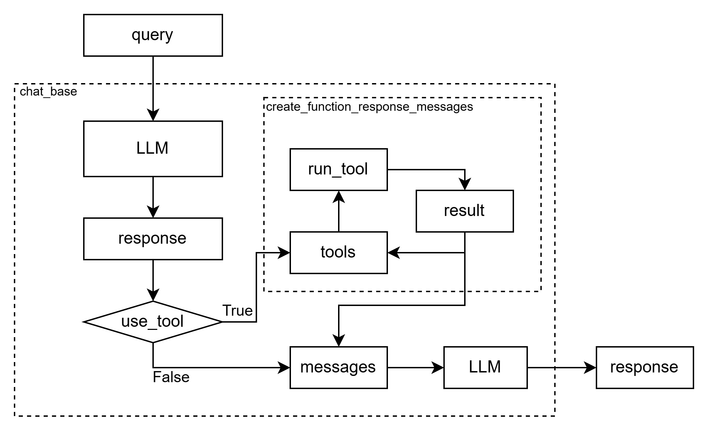

# Agent基础架构

MiniManus架构如下:
<center>



</center>

## 核心函数chatbase
```python
def chat_base(messages, client, model):
    """
    获得一次模型对用户的响应。若其中需要调用外部函数，
    则会反复多次调用create_function_response_messages函数获得外部函数响应。
    """
    
    client = client
    model = model
    
    try:
        response = client.chat.completions.create(
            model=model,  
            messages=messages,
            tools=tools,
        )
        
    except Exception as e:
        print("模型调用报错" + str(e))
        return None
    print(response.choices[0].message)
    if response.choices[0].finish_reason == "tool_calls":
        while True:
            messages = create_function_response_messages(messages, response)
            response = client.chat.completions.create(
                model=model,  
                messages=messages,
                tools=tools,
            )
            print(response.choices[0].message)

            if response.choices[0].finish_reason != "tool_calls":
                break
    
    return response
```
输入message, 输出response。功能:
- 进行一次不调用工具的对话
- 进行一次需要调用function calling的对话, 对迭代循环直至不需要调用工具。

1. 函数参数：
   - `messages`: 对话历史消息列表
   - `client`: AI 客户端实例
   - `model`: 使用的模型名称

2. 主要功能流程：
   - 首先尝试调用 AI 模型获取响应
   - 如果响应中包含工具调用（`tool_calls`），则会进入循环处理
   - 循环中会处理工具调用的响应，直到获得最终结果

3. 工具调用处理：
   - 当模型返回 `finish_reason` 为 "tool_calls" 时，表示需要调用外部工具
   - 通过 `create_function_response_messages` 函数处理工具调用
   - 循环调用模型直到获得最终响应（`finish_reason` 不再是 "tool_calls"）

## 循环调用工具

```python
def create_function_response_messages(messages, response):
    
    """
    调用外部工具，并更新消息列表
    :param messages: 原始消息列表
    :param response: 模型某次包含外部工具调用请求的响应结果
    :return：messages，追加了外部工具运行结果后的消息列表
    """

    available_functions = {
        "python_inter": python_inter,
        "fig_inter": fig_inter,
        "sql_inter": sql_inter,
        "extract_data": extract_data,
    }
    
    # 提取function call messages
    function_call_messages = response.choices[0].message.tool_calls

    # 将function call messages追加到消息列表中
    messages.append(response.choices[0].message.model_dump())

    # 提取本次外部函数调用的每个任务请求
    for function_call_message in function_call_messages:
        
        # 提取外部函数名称
        tool_name = function_call_message.function.name
        # 提取外部函数参数
        tool_args = json.loads(function_call_message.function.arguments)       
        
        # 查找外部函数
        fuction_to_call = available_functions[tool_name]

        # 打印代码
        print_code_if_exists(function_args=tool_args)

        # 运行外部函数
        try:
            tool_args['g'] = globals()
            # 运行外部函数
            function_response = fuction_to_call(**tool_args)
        except Exception as e:
            function_response = "函数运行报错如下:" + str(e)

        # 拼接消息队列
        messages.append(
            {
                "role": "tool",
                "content": function_response,
                "tool_call_id": function_call_message.id,
            }
        )
        
    return messages     
```

输入ToolCallMessage, 输出message。对于输入的需要调用Tools的Message, 循环调用所有工具。
